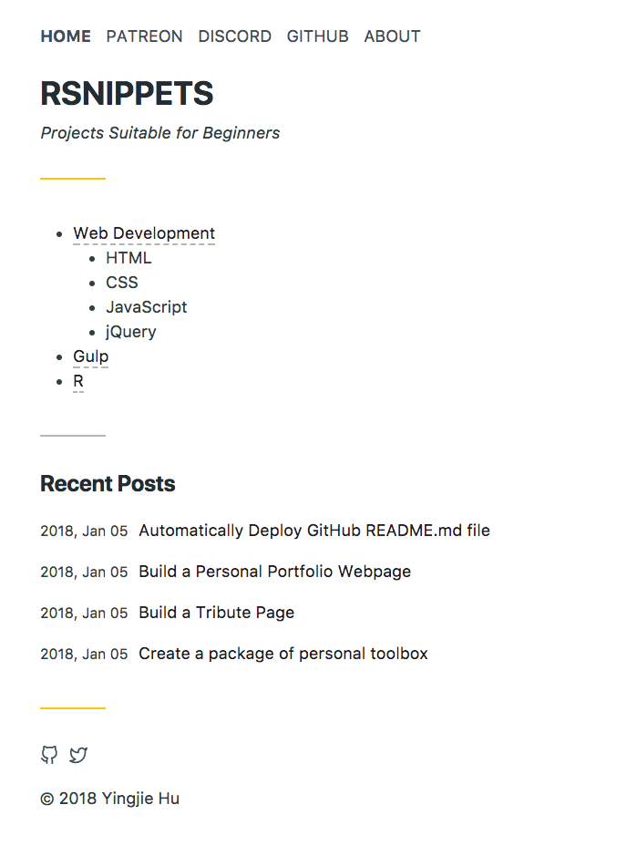
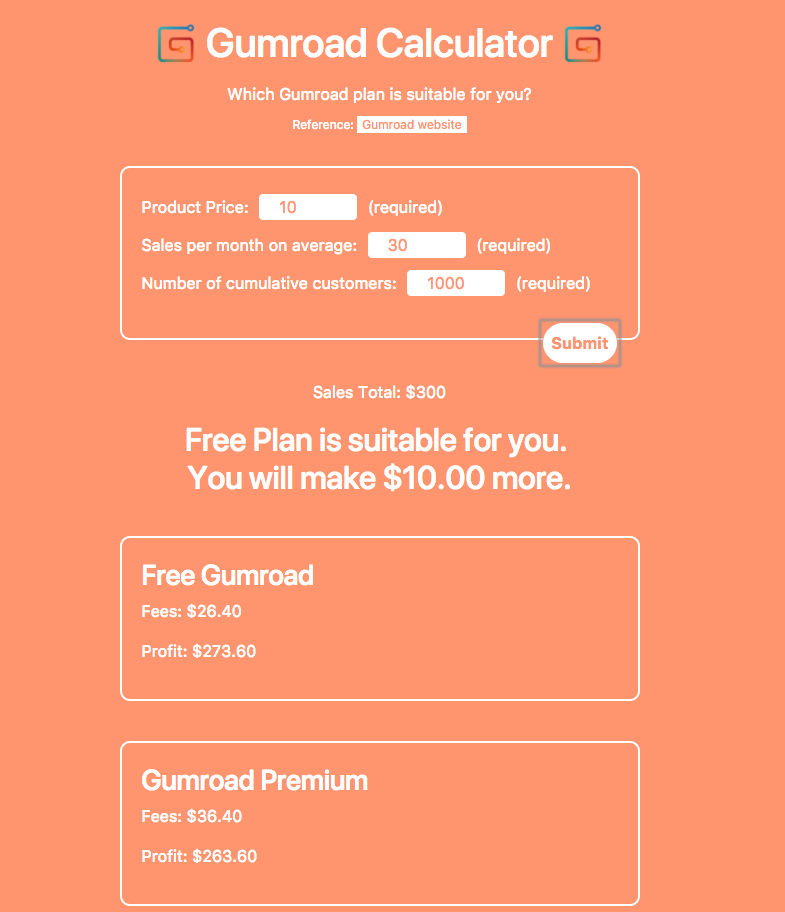
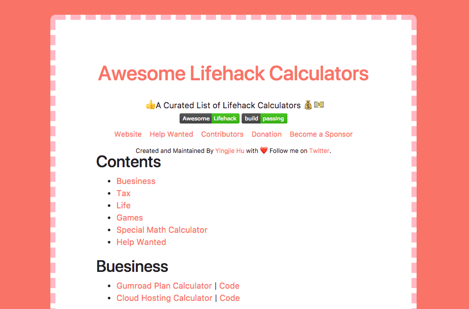

Main Commitment: I will make projects to develope front-end develoment skill. 

Start Date: 2017-12-06


<!-- more -->

## Rules

1. I will code to make projects from [FreeCodeCamp](https://www.freecodecamp.org/) for at least an hour every day.
2. I will [tweet my progress every day](https://twitter.com/yingjieYJH), with the hashtag `#100DaysOfCode #GoogleUdacityScholars #GrowWithGoogle #freecodecamp` and note which day of the challenge I’m on.
3. I will track my progress here and push to GitHub.
4. My daily job is not related to front-end development. All time spent on working on web development will count towards the challenge.
5. I will only skip a day if something important comes up. And when I resume, I won’t count the day I skipped as one of my 100 days.
5. I will encourage and support at least two people each day in the `#100DaysOfCode #GoogleUdacityScholars #GrowWithGoogle` and `#100DaysOfCode #freecodecamp` challenge on Twitter. I can read at most 5 tweets about `#100DaysOfCode #GoogleUdacityScholars #GrowWithGoogle #freecodecamp` each day. Less is more. Don't spend more than enough time on the social networking website.

	3 Options
	
	* Like tweets
	* Leave a comment
	* (optional) Looking at their projects and giving them feedback (no more than 10 minutes per day)

## Rule Updates

* 2018-01-11: I got `Grow with Google Challenge Scholarship` today. Hence, I added `#GoogleUdacityScholars #GrowWithGoogle` to the hashtag list. 

## Some important additional considerations

* Don't skip two days in a row, and try not to skip more than 1 day in 2 weeks.

## Milestones

1. [1 Day (Day 1: 2017-12-06 Wednesday)](#Day-1-2017-12-06-Wednesday)
2. [7 Days (Day 7: 2017-12-12 Monday)](#Day-7-2017-12-12-Monday)
3. [Day 18 (2017-12-25 Monday)](#Day-18-2017-12-25-Monday): Make the first personal project [Project 9: Awesome Shiny Apps for Statistics](http://asas.yingjiehu.com/) and get over 10 stars on GitHub within one day
3. [30 Days (2018-01-07 Sunday)](#Day-30-2018-01-07-Sunday)
4. 60 Days
5. 90 Days
6. 100 Days

## Project list

* [Github Repo](https://github.com/huyingjie/tribute-zhugeliang) | [Project 1: Tribue](http://zhugeliang.yingjiehu.com/)
* [Github Repo](https://github.com/huyingjie/projects-page) | [Project 2: Personal Portfolio](http://projects.yingjiehu.com/)
* [Github Repo](https://github.com/huyingjie/randomquotemachine) | [Project 3: Random Quote Machine](http://randomquotemachine.yingjiehu.com/)
* [Github Repo](https://github.com/huyingjie/theLocalWeather) | [Project 4: the Local Weather](http://localweather.yingjiehu.com/)
* [Github Repo](https://github.com/huyingjie/wikipediaViewer) | [Project 5: A Wikipedia Viewer](http://wikipediaviewer.yingjiehu.com)
* [Project 6: Visualize Data with a Bar Chart](https://codepen.io/yingjiehu/pen/Mrbmom)
* Project 7: visualize Data with a Scatterplot Graph
* Project 8: Visualize Data with a Heat Map
* 2017-12-25 [Github Repo](https://github.com/huyingjie/Awesome-shiny-apps-for-statistics) | [Project 9: Awesome Shiny Apps for Statistics](http://asas.yingjiehu.com/)
* 2017-12-26 [Github Repo](https://github.com/huyingjie/must-watch-must-watch) | [Project 10: Must-Watch Must-Watch List](http://mustwatch.yingjiehu.com/)
* 2017-12-26 [Github Repo](https://github.com/huyingjie/Checklist-Checklist) | [Project 11: Awesome Checklist Checklist](http://checklist.yingjiehu.com/)
* 2018-01-05 [Github Repo](https://github.com/huyingjie/rsnippets) | [Project 12: RSnippets.com](http://rsnippets.com/)
* 2018-01-08 [Github Repo](https://github.com/huyingjie/gumroad-plan-calculator) | [Project 13: Gumroad Plan Calculator](http://gumroadplancalculator.yingjiehu.com/)
* 2018-01-09 [Github Repo](https://github.com/huyingjie/awesome-lifehack-calculators) | [Project 14: Awesome Lifehack Calculators](http://lifehackcalculators.yingjiehu.com/)

## Template for Log
```
### Day : 

**Link**: [Github Repo]() | [Project :]()

**Today's Progress (achievements and frustrations)**: 

**Thoughts and Emotions:**

**Tomorrow's plan**

<hr>
```

<hr>
## LOG
### Day 1: 2017-12-06 Wednesday 
**Link**: [Github Repo](https://github.com/huyingjie/tribute-zhugeliang) | [Project 1: Tribue](http://zhugeliang.yingjiehu.com/)

**Today's Progress (achievements and frustrations)**: 

* finished the first project "Build a Tribute Page".


**Thoughts and Emotions:**

I finished the tutorials of Bootstrap and jQuery. After that, I started the first project "Build a Tribute Page".

Zhuge Liang is a historical figure that I admire. I feel excited to make a tribute page to him.

Today is the first time I use Bootstrap though I heard it a lot in the past. This tool is awesome. 

It's an intense work. Luckily, all questions along the way were solved by myself. It took around 3 hours. 


<hr>

### Day 2: 2017-12-07 Thursday
**Link**: [Github Repo](https://github.com/huyingjie/projects-page) | [Project 2: Personal Portfolio](http://projects.yingjiehu.com/)

**Today's Progress (achievements and frustrations)**: 

* Started the second project "Personal Portfolio".
* Worked on toggle button and `scrollspy` for at least 4 hours. Finally solved. Thank `@keller0` Cai and `@meitounaoqiao` 殷蔚乔 for help in [FreeCodeCamp/chinese](https://gitter.im/FreeCodeCamp/chinese).

**Thoughts and Emotions:**
I already have had a personal website, and my daily job is not website development. But I want to have a fancy project page. 

My purpose to do the "Personal Protolio" project is to list my projects in all fields I am interested in, such as data science, web development. In the future, the list of fields will increase. The project page is ready for it.

Today is a tough day. "Personal Portfolio" is a difficult project. I spent several hours in navigation which uses `scrollspy` and toggle button. There are some differences in `scrollspy` between Bootstrap 3 and Bootstrap 4. 

I felt discouraged and wasted time. Then I decided to seek help online. This is a right decision. 

[FreeCodeCamp/chinese](https://gitter.im/FreeCodeCamp/chinese) is the channel most suitable for me. 

Reference: 

* [Scroll @Bootstrap 4](https://getbootstrap.com/docs/4.0/components/scrollspy/)
* [Scroll @Bootstrap 4 beta](https://v4-alpha.getbootstrap.com/components/scrollspy/)
* [Navbar togglers](http://getbootstrap.com/docs/4.0/components/navbar/#toggler)

<hr>
### Day 3: 2017-12-08 Friday
**Link**: [Github Repo](https://github.com/huyingjie/projects-page) | [Project 2: Personal Portfolio](http://projects.yingjiehu.com/)

**Today's Progress (achievements and frustrations)**: 

* edit the first section
* add `100-DAY CHALLENGES` section
* change Awesome Font Icon from 4 to 5

**Thoughts and Emotions:**

I am a little bit depressed today. The whole day I searched one content on iPad lying in bed. At night I got up, had dinner, took a shower, and did laundry. And then I started resuming doing the yesterday's work.

Even if I made big progress yesterday, I spent almost all day to work the project. It is very bad. Other important things are pushed away, and this will increase my stress level. The result is that I will burn out more easily and the probability of quitting the 100-day challenge will increase.

I promised myself at around 6 that I would do the project for one hour. To make it work, I set a timer. Sadly, I broke the promise and worked much longer than I promised. It is 3 a.m. now.

Today I almost finished the 2nd project Personal Portfolio except for one problem: collapsable menu. This is [an example from w3 school](https://www.w3schools.com/bootstrap/tryit.asp?filename=trybs_ref_js_scrollspy&stacked=h). When the screen is small, the menu is collapsed. When I open the menu, the menu is overlapped with the content below.

I posted the question in the gitter of FreeCodeCamp. I will go to sleep and hope that the answer will appear tomorrow.

<hr>

### Day 4: 2017-12-09 Saturday
**Link**: [Github Repo](https://github.com/huyingjie/projects-page) | [Project 2: Personal Portfolio](http://projects.yingjiehu.com/)

**Today's Progress (achievements and frustrations)**: 

* changed color scheme
* added jump to top button
* asked yesterday's question in FreeCodeCamp forum because I got no answer in the gitter
* Finished Project 2: Personal Portfolio

**Thoughts and Emotions:**

I started coding at 12 a.m. because I spent a lot of time during the day in freeing up space for Mac Air to install Mac OS High Sierra. 

Initially, I planned to finish project 2 in one hour and spend two hours in fact. The final color scheme of the website still looks strange. After I learn following courses in FreeCodeCamp in the future, I can polish the website. Finishing one not-perfect product is better than a never-finish product.

<hr>
### Day 5: 2017-12-10 Sunday 
**Link**: [Github Repo](https://github.com/huyingjie/randomquotemachine) | [Project 3: Random Quote Machine](http://randomquotemachine.yingjiehu.com/)

**Today's Progress (achievements and frustrations)**: 

* Project 2 "Personal Portfolio" amendment
	* added padding to the right of icons
	* added icons in front of titles of sections
* Started Project 3 "Random Quote Machine"

**Thoughts and Emotions:**

There are lots of JavaScript tutorials before project 3 in freeCodeCamp. If I start projects until finishing tutorials, I will forget much knowledge I have learned so far, and it will be harder to continue 100DaysCoder challenge. I plan to complete `CSS` part of projects and started `Javascript` part until I studied all `JavaScript` tutorials.

Today's plan was 2-hour tutorial and 1-hour coding. Studying tutorials for 2 hours was as planned. However, I spent much more time in coding than one hour. It is hard to start and harder to stop. It happens to all aspects of my life. I do not know how to solve it. Happiness was generated when one-hour coding was completed. Stress increased as time came by after one hour.

I am happy that I found a useful Atom plugin `Auto-live-server` . It refreshed the local webpage when web development related files are saved.

There is one problem I asked in the gitter. 

Button's border style is not consistent with different browsers. Here is my code.

```css
button {
  color: white;
  background-color: pink;
  box-shadow: 0;
  border:none;
}
	
button:focus {
  border:none;
}
	
```

* Chrome has a border around the button after I click it.
* Safari and codepen do not have the border.


**Tomorrow's plan**

* [x]study tutorial for 1 hour (not count towards the challenge)
* [x]Project 3 Random Quotes Machine
	* [x]move `CSS` to `main.css`
	* [x]rethink how to structure `css` file
	* [x]adjust the width of border of quotes
	* [x]adjust the size of social media icons
* [x]Project 2 Project Portolio
	* [x]look for a picture for Project 2
	* [x]change Project 2 status from `Ongoing` to `Complete`
	* [x]add Project 3 and set it `Ongoing`
	* [x]create a new challenge

<hr>

### Day 6: 2017-12-11 Monday

**Link**: 

* [Github Repo](https://github.com/huyingjie/projects-page) | [Project 2: Personal Portfolio](http://projects.yingjiehu.com/)
* [Github Repo](https://github.com/huyingjie/randomquotemachine) | [Project 3: Random Quote Machine](http://randomquotemachine.yingjiehu.com/)

**Today's Progress (achievements and frustrations)**: 

* completed the plan set yesterday!!
* Project 2 Project Portolio

	* [x] move `CSS` to `main.css`
	* [x] move JavaScript to `/scripts`

Styling using pure `CSS` takes a lot of time. Adding a graph is simpler and more beautiful.

**Thoughts and Emotions:**

Before learning in freecodecamp, I thought front-end development incorporated designing websites. I like coding part but not designing. Two parts are knitted together during the process of learning. Projects showing from other students in freecodecamp are more beautiful than my page. This made me feel bad.

It is satisfying to change project status from "ongoing" to "complete" and add new projects to my project portfolio page.

Again, when I started doing projects, it is hard to stop. Now is 12 a.m. 

**Tomorrow's plan**

* [x]study tutorial for 1 hour (not count towards the challenge)
* [x]Start to do the html part of Project 4: the Local Weather for one hour only. Don't overdo.

<hr>

### Day 7: 2017-12-12 Tuesday
**Link**: [Github Repo](https://github.com/huyingjie/theLocalWeather) | [Project 4: the Local Weather](http://localweather.yingjiehu.com/)

**Today's Progress (achievements and frustrations)**: 

I finished all items on the todo list created  yesterday.

**Thoughts and Emotions:**

It is the 7th day!! I have been doing this challenge for one week. It is the 2nd [milestone](#Milestones) 😃

Though HTML part of [Project 4](http://localweather.yingjiehu.com/) is simpler than that of [Project 3](http://randomquotemachine.yingjiehu.com/), I was amazed that I finished building it in one and half an hour including time of seeking help in gitter. The files of `HTML` and `CSS` are clean, and the logic of codes are clear. I am satisfied with what have been done today.
 
I will start to code `HTML` part of Project 5 tomorrow. The project is cool because of both functionality and design. 

One hour per day is devoted to learning tutorials in FreeCodeCamp. The progress will be slow. I am overwhelmed by the number of lessons needed to learn before I can touch `JavaScript` part of Project 3-5. Basic algorithm scripting based on FreeCodeCamp can require around 50 hours!!!

**Tomorrow's plan**

* [x]Study tutorial for 1 hour (not count towards the challenge)
* [x]Work on suggestion from gitter
* [ ]Start to do the `HTML` part of Project 5: Build a Wikipedia Viewer for one hour only. Don't overdo.

```
Sorin Ruse @sorinr 22:05
@huyingjie add also in css background-repeat: no-repeat; to the body selector
	
@huyingjie and also background-attachment: fixed; to make the img full width/height even when you resize the screen
	
Sorin Ruse @sorinr 22:12
@huyingjie you may also look into positioning the background and apply the one that fits your needs <https://developer.mozilla.org/en-US/docs/Web/CSS/background-position>
```
<hr>


### Day 8: 2017-12-13 Wednesday
**Link**: [Github Repo](https://github.com/huyingjie/projects-page) | [Project 2: Personal Portfolio](http://projects.yingjiehu.com/)

**Today's Progress (achievements and frustrations)**: 

* [x]Study tutorial for 1 hour (not count towards the challenge)
* [x]Work on suggestion from gitter
* [ ]Start to do the `HTML` part of Project 5: Build a Wikipedia Viewer for one hour only. Don't overdo.
* [x]Add Project 4 to [project page](http://projects.yingjiehu.com)

**Thoughts and Emotions:**

The time spent on adding new projects to [project page](http://projects.yingjiehu.com) was longer than I expected. The list of projects is formatted by decks with Bootstrap 4. I feel the design is a little bit uncomfortable but don't know why. At the end of today's task, I asked  [the question in FreeCodeCamp forum](https://forum.freecodecamp.org/t/ask-for-styling-advice-of-project-portfolio/163627). 

There is no time to touch project 5 today. It will be tomorrow's task.

Basic algorithm scripting based on FreeCodeCamp can require around 50 hours. This makes me feel nervous. The best way to remove the negative emotion is to have a try. I did one algorithm and learned the format of algorithm scripting. The problems in the section are to use `JavaScript` array methods learned in the last section. Array methods are similar to `Swift` I learned 2 years ago. Even though I forgot the details of `Swift`, familiarity can help me learn counterparts in `JavaScript`.

**Tomorrow's plan**

* [x]Study tutorial for 1 hour (not count towards the challenge)
* [ ]Start to do the `HTML` part of Project 5: Build a Wikipedia Viewer for one hour only. Don't overdo.
* [x]Read answers in [FreeCodeCamp forum](https://forum.freecodecamp.org/t/ask-for-styling-advice-of-project-portfolio/163627). 

### Day 9: 2017-12-14 Thursday 
**Link**: [Github Repo](https://github.com/huyingjie/projects-page) | [Project 2: Personal Portfolio](http://projects.yingjiehu.com/)

**Today's Progress (achievements and frustrations)**: 

I read the reply to Personal Portfolio site feedback in [FreeCodeCamp forum](https://forum.freecodecamp.org/t/ask-for-styling-advice-of-project-portfolio/163627). 

The reply gave 6 points needed to improve.

* 5 points I solved today
	
	* Make sure the items have a bit of space around them on smaller screens. On a mobile they go right to the edge of the screen, which looks a bit cramped.

		Solution: add `padding: 80px` to `.section`
		```css
		section {
		  border-style: solid;
		  border-width: 0px 0px 0px 0px;
		  box-shadow: 0px 2px rgb(160,160,160);
		  padding: 80px;
		}
		```
	* Make sure the images align - the ‘Ongoing’ header seems to push the image down a bit further than the ones on completed projects.
	
		Originally, I used `<span class="fa-layers fa-fw fa-2x">`. After deleting `fa-2x`, it became `<span class="fa-layers fa-fw">` and the problem solved.
		
		```html
		<span class="fa-layers fa-fw">
			<div class="fa-3x">
				<i class="fas fa-certificate text-danger"></i>
				<span class="fa-layers-text fa-inverse text-warning" data-fa-transform="shrink-11.5 rotate--30 right-5">NEW</span>
			</div>
		</span>
		```
	* The sections could do with a bit more vertical spacing at the bottom
		Solution: add `padding: 80px` to `.section`
	
		The same with the first one.
		
	* It’s Code not Codes

		Solution: replace `Codes` with `Code`
	* There’s a broken link to style.css

		Solution: delete the link

* 1 point I did not solve

	* On intermediate screen sizes the items get very narrow - maybe reduce the number of items per row sooner

**Thoughts and Emotions:**

Making small adjustments or improvements to the website can take as much time as making one. I spent over 1 hour in correcting Project 2: Personal Portfolio only.

It is a little bit discouraging because I have included starting Project 5 in tomorrow's plan for two days, but there is no time left for this project.

**Tomorrow's plan**

* [x]Study tutorial for 1 hour (not count towards the challenge)
* [x]Start to do the `HTML` part of Project 5: Build a Wikipedia Viewer for one hour only. Don't overdo.

<hr>

### Day 10: 2017-12-15 Friday  
**Link**: [Github Repo](https://github.com/huyingjie/wikipediaViewer) | [Project 5: A Wikipedia Viewer](http://wikipediaviewer.yingjiehu.com)

**Today's Progress (achievements and frustrations)**: 

* Started project 5

**Thoughts and Emotions:**

I finally started Project 5. Among the only 5 projects, this is the first project which uses `jQuery`. I am excited to see the page has animation; if a user clicks the search icon, the search bar will appear and the search icon will disappear. It is fun.  

**Tomorrow's plan**

* [x]Study tutorial for 1 hour (not count towards the challenge)
* [ ]Project 5: A Wikipedia Viewer
	* [ ]Adjust the style of search bar
	* [ ]Make the search icon and the search bar the same height
	* [x]Change action field to search button
	* [ ]Adjust animation
		* [ ]If search bar is empty, click search button, the search bar will disappear and the search icon will appear.
		* [ ]If search bar is not empty, searching action is activated
* [x]Add footer to Project 3: Random Quote Machine
* [x]Add footer to Project 4: the Local Weather

<hr>

### Day 11: 2017-12-16 Saturday 
**Link**: [Github Repo](https://github.com/huyingjie/wikipediaViewer) | [Project 5: A Wikipedia Viewer](http://wikipediaviewer.yingjiehu.com)

**Today's Progress (achievements and frustrations)**: 
I finished 4 items in yesterday's plan.

frustration:

* alignment of footer
* How a search button is put inside a search text bar?
* How positions of the search button and search text bar are not change when screen size changes?

I will questions tomorrow in gitter.

**Thoughts and Emotions:**

Today is the toughest day. I struggle with several things in my personal life. During the day, I tried putting dynamic graphs generated by `R` package on the blog. There are no `JavaScript` library link and `JavaScript` code block containing data, then I cannot paste them to a Markdown or HTML file. R community including statistics community lacks good documentation and coding quality is poor. My knowledge of R never seems sufficient to find the solution to them. I feel constricted and frustrated all the time.

Yesterday I thought I could finish the `Basic Algorithm Script` today. It is more difficult than I expected.

* If a function has lots of argument without argument name, use `Array.prototype.slice.call(arguments, 0)` to get all arguments
* `array.slice()`'s second argument is the end index - 1, not the number of characters to be sliced.

I guess writing pseudocode before programming will help.

**Tomorrow's plan**

* [ ]Study tutorial for 1 hour (not count towards the challenge)
* [ ]Project 5: A Wikipedia Viewer
	* [ ]ask in gitter
		* [ ]alignment of footer
		* [ ]How a search button is put inside a search text bar?
		* [ ]How positions of the search button and search text bar are not change when screen size changes?
	* [ ]Adjust the style of search bar
	* [ ]Make the search icon and the search bar the same height
	* [ ]Adjust animation
		* [ ]If search bar is empty, click search button, the search bar will disappear and the search icon will appear.
		* [ ]If search bar is not empty, searching action is activated

<hr>

### Day 12: 2017-12-19 Tuesday 
**Link**: [Github Repo](https://github.com/huyingjie/randomquotemachine) | [Project 3: Random Quote Machine](http://randomquotemachine.yingjiehu.com/)

**Today's Progress (achievements and frustrations)**: 

* Study tutorial for 1 hour (not count towards the challenge)
Project 3
* Created a JSON file containing ancient Chinese sayings
	1. Generate a random integer to select which sayings to show
	1. Get JSON data from the JSON file
	1. Calculate length of the JSON data
	1. Get the first element of the first element in the JSON data
	
**Thoughts and Emotions:**

* I skipped two days because I prepared a presentation for today's seminar.
* I did not follow the plan created on 2017-12-16 because I finished "Basic Algorithm Scripting" part (accumlatively around 7 hours) and started learning "JSON APIs and Ajax". I want to apply the knowledge learned today to today's work.
* I finished 5 things under Project 3 in Today's progress. Each thing requires me searching online. They are not easy tasks for a newbie. Hence, they created a lot of frustration. 

I am a little bit discouraged by the slow process. When I thought of the fact that they were done in 1 hour, it created more hope. 

**Tomorrow's plan**

* [x]Study tutorial for 1 hour (not count towards the challenge)
* Do Project 3 for 1 hour:
	* [x]Make each element in JSON data appear in HTML
	* [x]Click button to change the quote

If there is time left, 

* [x]Create a JSON file of colors
* [x]Generate random number for colors
* [x]Edit HTML to change color
<hr>

### Day 13: 2017-12-20 Wednesday 
**Link**: [Github Repo](https://github.com/huyingjie/randomquotemachine) | [Project 3: Random Quote Machine](http://randomquotemachine.yingjiehu.com/)

**Today's Progress (achievements and frustrations)**: 

* Finished "JSON APIs and Ajax" section.
* Started "Intermediate Algorithm Scripting" section.
* Within one hour, I finished items on the yesterday's plan and addition plan.


**Thoughts and Emotions:**

It is fun. 

I like animation very much. Learning Making animation using Adobe Animator requires a lot of energy and time. Animation provided by JavaScript gives me enough joy, and its complexity is not overwhelming. In the future, I want to learn more.

I like to create interactive graphs of data. It is also related to my major. Tomorrow I will start learning data visualization on the beta website and suspend "Intermediate Algorithm Scripting" part until projects from data visualization are completed. After finishing Project 3, I will start data visualization projects.


Joe Warren wrote a post on freeCodeCamp medium, [How to Transform Your #100DaysOfCode Log Into a Visual Experience](https://medium.freecodecamp.org/how-to-transform-your-100daysofcode-log-into-a-visual-experience-d048334af8d9). He gave a lot of good advice on how to create a good log of 100 days challenge. He used [his log](https://github.com/MightyJoeW/100-Days-of-Code/blob/master/log.md) as an example. In the comment, I asked whether he could give some advice on my log. He kindly gave me a long reply.


**Tomorrow's plan**

* [x]Study tutorial for 1 hour (not count towards the challenge)
* [ ]Project 3: Random Quote Machine
	* [x]Enlarge quote icon
	* [ ]Add tumblr share action
	* [x]Add twitter share action
	* [ ]Add quote: animation
		1. show quote icon
		2. wait for 1 second
		3. show the quote

<hr>

### Day 14: 2017-12-21 Thursday

**Link**: [Github Repo](https://github.com/huyingjie/randomquotemachine) | [Project 3: Random Quote Machine](http://randomquotemachine.yingjiehu.com/)

**Today's Progress (achievements and frustrations)**: 

* Started learning `D3.js`
* Added Twitter share action

**Thoughts and Emotions:**

Adding Twitter share action took more time than I expected. I like to read examples in the process of learning but Twitter API website has few examples.


I am depressed today. I don't know why. 

I spent a lot of time trying how to change the style of outputs from R notebook made by RStudio. A lot of time was spent on editing existing CSS file. At last, I found I did not need to touch any existing stylesheet. It is enough to create a new sheet and to include it after existing sheet. This is the fastest way to change the style from other people's CSS.

**Tomorrow's plan**

* [x]Studied tutorial for 1 hour (not count towards the challenge)
* [x]Project 3: Random Quote Machine
	* [x]Add tumblr share action
	* [x]Add quote: animation
		1. show quote icon
		2. wait for 1 second
		3. show the quote

<hr>

### Day 15: 2017-12-22 Friday 

**Link**: [Github Repo](https://github.com/huyingjie/randomquotemachine) | [Project 3: Random Quote Machine](http://randomquotemachine.yingjiehu.com/)

**Today's Progress (achievements and frustrations)**: 

* Learned Data Visualization on Freecodecamp Beta website
* Opened and closed an issue in GitHub
* Completed Project 3: Random Quote Machine

**Thoughts and Emotions:**

* I met a lot of arrow functions in the Data Visualization tutorials. Arrow functions from ES6 are taught in the Beta, not on the main website. I did not know the name of the function. When I searched closure function, tutorials online gave the normal functions. 

	Then I asked this question in gitter. One person kindly answered it. 
	
	I will learn arrow functions tomorrow first.

	
* I opened one issue on freecodecamp GitHub

	
	
	I used Chrome to do challenges. When the test did not pass, initially I thought the reason was that I did not know arrow functions. 
	
	Then the code was copied to [an empty HTML file](test.html). The bar plot was correctly shown. I guessed it was a browser issue and used Safari to run the same challenge. Safari passed my code. This made me confirmed that some code on the page on the website behaved differently between browsers.
	
	**Update:** After restarting the computer, chrome works, and then I closed the GitHub issue. My Mac Air was connected to an external monitor. After several days usage, it has some problems, such as Chrome. Restarting the laptop can solve them.
	
	
**Tomorrow's plan**

* [x]Study tutorial for 1 hour (not count towards the challenge)
* [x]Start data visualization project

<hr>

### Day 16: 2017-12-23 Saturday

**Link**: [Project 6: Visualize Data with a Bar Chart](https://codepen.io/yingjiehu/pen/Mrbmom)

**Today's Progress (achievements and frustrations)**: 

* Started doing Project 6: Visualize Data with a Bar Chart

frustration

* The footer cannot be centered at the bottom
* The location of d3 graph is not adjusted with HTML.
* The height of bar plot should be adjusted

**Thoughts and Emotions:**

Styling is more difficult than visualization for me.

I used Bootstrap 4 and footer cannot be centered at the bottom. It is annoying.


**Tomorrow's plan**

* [x]Study tutorial for 1 hour (not count towards the challenge)
* [x]Project 6: Visualize Data with a Bar Chart

<hr>

### Day 17: 2017-12-24  Sunday

**Link**: [Project 6: Visualize Data with a Bar Chart](https://codepen.io/yingjiehu/pen/Mrbmom)

**Today's Progress (achievements and frustrations)**: 

* Did Project 6: Visualize Data with a Bar Chart
* Did Project 7: visualize Data with a Scatterplot Graph
* Did Project 8: Visualize Data with a Heat Map
* Created a banner for the challenge

Based on the knowledge I learned from FreeCodeCamp, I cannot finish any of them then I started a new one. After learning all tutorials of data visualization, I will search online for the things not taught in FreeCodeCamp.

**Thoughts and Emotions:**

Learning data visualization is more boring than I expected. It seems more difficult than `JavaScript` because all functions are self-defined and sometimes do not conform standard `JavaScript` function construction rule.

**Tomorrow's plan**

* [ ]Study tutorial for 1 hour (not count towards the challenge)
* [ ]Change project status
* [ ]Add new projects
* [ ]Project 6: Visualize Data with a Bar Chart

<hr>

### Day 18: 2017-12-25 Monday 

**Link**: 

* [Github Repo](https://github.com/huyingjie/Awesome-shiny-apps-for-statistics) | [Project 9: Awesome Shiny Apps for Statistics](http://asas.yingjiehu.com/)
* [Github Repo](https://github.com/huyingjie/randomquotemachine) | [Project 3: Random Quote Machine](http://randomquotemachine.yingjiehu.com/)

**Today's Progress (achievements and frustrations)**: 

* Changed colors in the [Project 3: Random Quote Machine](http://randomquotemachine.yingjiehu.com/).
* Finished [Project 9: Awesome Shiny Apps for Statistics](http://asas.yingjiehu.com/)
* [Github Repo](https://github.com/huyingjie/must-watch-must-watch) | Project 10: Must-Watch Must-Watch List

**Thoughts and Emotions:**

`@crossey` on the gitter told me that colors in the [Project 3: Random Quote Machine](http://randomquotemachine.yingjiehu.com/) were not good. I guessed that colors were too vivid and eyes did not feel comfortable when seeing them. I found that most of the colors that had color names and beganb with "light" were suitable for eyes. 

Yesterday's night, I suddenly had an idea to make a GitHub awesome list of Shiny Apps. The apps are specific for learning statistics, not showing results from data analysis. It is better if there will be a website automatically generated from `README.md` file from the GitHub repo, then the effort to keep the website and `README.md` being same will be zero. Usually, people contribute to an awesome list by editing `README.md`. It is the  owner's responsibility of the GitHub repo to sync between GitHub and the website. 

How to sync automatically is the most difficult part for me. My blog is using Netlify to automatically deploy. I need to learn one templating engine to combine data in `README.md` and templates created by a templating engine by Netlify. I started to learning `Go` on the YouTube. I realized that `Go` was a completely new language and if I wanted to use it, I had to learn a lof things. Then I recalled [Front-End-Checklist](https://github.com/thedaviddias/Front-End-Checklist#table-of-contents) using `gulp`. Initially, I thought `gulp` was a template engine. After reading one tutorial, I knew it was not and can use it to create a web page without styling through `gulp-markdown`. `gulp-rename` is used to change the filename from `README.md` to `index.md`, then `gulp-markdown` generated `index.html`. The HTML codes inside `index.html` do not contain `head` and `body` elements. It turns out to be an advantage. `gulp-wrapper` adds `head` and `body` elements before and after the codes. The resulting website was successfully deployed by Nelify. I achieved to sync between `README.md` and the website.

Today, I spent time in changing the website style and gathered Shiny apps.

I worked more than 10 hours today. I am satisfied with the result. One thing needed to improve in the future is the styling of the site.


[Project 10: Must-Watch Must-Watch List](https://github.com/huyingjie/must-watch-must-watch) was a mardown README.md file. I will add `gulp` to create a website syncing with `README.md`. 

**Tomorrow's plan**

* [ ]Study tutorial for 1 hour (not count towards the challenge)
* [ ]Change project status
* [ ]Add new projects
* [x][Github Repo](https://github.com/huyingjie/must-watch-must-watch) | Project 10: Must-Watch Must-Watch List
	* [x]Add a website
* [ ][Github Repo](https://github.com/huyingjie/theLocalWeather) | [Project 4: the Local Weather](http://localweather.yingjiehu.com/)
	* Start `JavaScript` part

<hr>

### Day 19: 2017-12-26 Tuesday

**Link**: 

* [Github Repo](https://github.com/huyingjie/must-watch-must-watch) | [Project 10: Must-Watch Must-Watch List](http://mustwatch.yingjiehu.com/)
* [Github Repo](https://github.com/huyingjie/Checklist-Checklist) | [Project 11: Awesome Checklist Checklist](http://checklist.yingjiehu.com/)

**Today's Progress (achievements and frustrations)**: 

* Created a website for [Project 10: Must-Watch Must-Watch List
](http://mustwatch.yingjiehu.com/)
* Created and completed [Github Repo](https://github.com/huyingjie/Checklist-Checklist) | [Project 11: Awesome Checklist Checklist](http://checklist.yingjiehu.com/)

**Thoughts and Emotions:**

Project 10 and 11 are similar to Project 9. The most time consuming part was to search GitHub, and to found the repos. There are 100 pages on GitHub about checklists. I used at least 5 hours to finish 100 pages. The process was boring. I am satisfied with Project 11. 


I will add styles after learning website design.

**Tomorrow's plan**

* [x]Study tutorial for 1 hour (not count towards the challenge)
* Project portolio
	* [x]Change project status
	* [x]Add new projects
* [x][Github Repo](https://github.com/huyingjie/theLocalWeather) | [Project 4: the Local Weather](http://localweather.yingjiehu.com/)
	* [x]Start `JavaScript` part

<hr>

### Day 20: 2017-12-28 Thursday

**Link**: [Github Repo](https://github.com/huyingjie/theLocalWeather) | [Project 4: the Local Weather](http://localweather.yingjiehu.com/)

**Today's Progress (achievements and frustrations)**: 

I finished all items on todo list designed the day before yesterday in one hour.

**Thoughts and Emotions:**

I did not use JavaScript for several days because I studied Data Visualization and did personal projects. Hard recall can lead to better memorization after several days.

I am discouraged by the websites on my wishlist. They seem complicated. A lot of decisions should be made. Example:

* Which Front-End framework should be used?
* Static website or dynamic website?
* If I choose dynamic websites, which Back-End framework should I use?
* Where to save the photos? Photos and the website will be saved in different locations.
* If I choose static websites

    * Which git website to use, GitLab or BitBucket?
    * which deploy website should I use?

In addition, I have to wait until I learn Back-End knowledge. 

Filling mind with undecided stuff is not a comfortable experience.

Besides, even if I did projects for several days, they were not FreeCodeCamp project and then I need more willpower to initiate today's work.

**Tomorrow's plan**

* [x]Study tutorial for 1 hour (not count towards the challenge)
* [ ][Github Repo](https://github.com/huyingjie/theLocalWeather) | [Project 4: the Local Weather](http://localweather.yingjiehu.com/)
	* [x]Obtain data from weather API
	* [x]Add CSS `id` so that the weather info will be added
	* [x]Connect data with HTML codes

<hr>

### Day 21: 2017-12-29 Friday


**Link**: [Github Repo](https://github.com/huyingjie/theLocalWeather) | [Project 4: the Local Weather](http://localweather.yingjiehu.com/)

**Today's Progress (achievements and frustrations)**: 

* Project 4: Parts of CSS `id` were connected to data in API
* [x]Add a function to transform between F and C

**Thoughts and Emotions:**

The weather channel does not show information from the weather API. There is one error

```
[Deprecation] getCurrentPosition() and watchPosition() no longer work on insecure origins. To use this feature, you should consider switching your application to a secure origin, such as HTTPS. See https://goo.gl/rStTGz for more details.
```
The corresponding code is following.

```
if (navigator.geolocation) {
      navigator.geolocation.getCurrentPosition(function(position) {
      }
}
```

In fact, the code was shown in the tutorial on FreeCodeCamp.

I will search it tomorrow.

Because I started doing projects from FreeCodeCamp yesterday, I started learning and programming much more easily today.

**Tomorrow's plan**

* [x]Study tutorial for 1 hour (not count towards the challenge)
* [ ][Github Repo](https://github.com/huyingjie/theLocalWeather) | [Project 4: the Local Weather](http://localweather.yingjiehu.com/)
	* [x]Get the location from Google
	* [x]Look for images of each weather condition
	* [ ]Add codes to show different weather picture based on weather condition
	* [ ]Add button in home page to change between F and C
	* [ ]Connect the function and the button
	* [ ]Check the replacement for `navigator.geolocation.getCurrentPosition()` function
	* [ ]Look for icons

<hr>

### Day 22: 2017-12-30 Saturday 

**Link**: [Github Repo](https://github.com/huyingjie/theLocalWeather) | [Project 4: the Local Weather](http://localweather.yingjiehu.com/)

**Today's Progress (achievements and frustrations)**: 

* Continued to do Project 4.

**Thoughts and Emotions:**

I lost interest in Project 4.

**Tomorrow's plan**

* [x]Study tutorial for 1 hour (not count towards the challenge)
* [ ][Github Repo](https://github.com/huyingjie/theLocalWeather) | [Project 4: the Local Weather](http://localweather.yingjiehu.com/)
	* [x]Add codes to show different weather picture based on weather condition
	* [ ]Add button in home page to change between F and C
	* [ ]Connect the function and the button
	* [ ]Check the replacement for `navigator.geolocation.getCurrentPosition()` function


<hr>

### Day 23: 2017-12-31 Sunday

**Link**: [Github Repo](https://github.com/huyingjie/theLocalWeather) | [Project 4: the Local Weather](http://localweather.yingjiehu.com/)

**Today's Progress (achievements and frustrations)**: 

Frustrated with how to write jQuery to change between F and C.

**Thoughts and Emotions:**

I met two problems and can solve neither of them within of one hour. I suddenly felt depressed in the middle of the coding.

**Tomorrow's plan**

* [x]Study tutorial for 1 hour (not count towards the challenge)
* [ ][Github Repo](https://github.com/huyingjie/theLocalWeather) | [Project 4: the Local Weather](http://localweather.yingjiehu.com/)
	* [x]Add button in home page to change between F and C
	* [x]Connect the function and the button
	* [x]Check the replacement for `navigator.geolocation.getCurrentPosition()` function

<hr>


### Day 24: 2018-01-01 Monday 

<div style="font-size:24px;" align="center">Happy New Year</div>

**Link**: [Github Repo](https://github.com/huyingjie/theLocalWeather) | [Project 4: the Local Weather](http://localweather.yingjiehu.com/)

**Today's Progress (achievements and frustrations)**: 

* Finished all items on the yesterday's plan.

**Thoughts and Emotions:**

Yesterday, I did not know how to toggle between Fahrenheit and Celsius for the coding project and had a hard time to find the least common multiple of two numbers for the algorithm on FreeCodeCamp. They made me worry about today's study. 

Writing my logic on paper help me finishing algorithm part. Writing the actions of clicking texts gave me a clear vision of how to toggle.

Happily, I finished both of them.

`navigator.geolocation.getCurrentPosition` is deprecated. Few answers on FreeCodeCamp forum mention it because websites hosted on a personal server or GitHub can meet the problem and most of the people put the project on CodePen.

The solution is to use a free geo API from <http://freegeoip.net/json/> instead of Google API. Tomorrow I will rewrite related codes.

When reading Twitter `#100DaysOfCode #freecodecamp`, I found a lot of people started 100 Day Challenge today. It's the first day of the year!!!

**Tomorrow's plan**

* [x]Study tutorial for 1 hour (not count towards the challenge)
* [x][Github Repo](https://github.com/huyingjie/theLocalWeather) | [Project 4: the Local Weather](http://localweather.yingjiehu.com/)
	* [x]Use geo api from <http://freegeoip.net/json/>
* [ ]Write README.md for projects

<hr>

### Day 25: 2018-01-02 Tuesday 


**Link**: [Github Repo](https://github.com/huyingjie/theLocalWeather) | [Project 4: the Local Weather](http://localweather.yingjiehu.com/)

**Today's Progress (achievements and frustrations)**: 

Finished [Project 4: the Local Weather](http://localweather.yingjiehu.com/)!!!

**Thoughts and Emotions:**

I used 1 day to finish HTML part and 6 days to complete JavaScript part of [Project 4: the Local Weather](http://localweather.yingjiehu.com/). Each day one hour was spent on the project.

Six days are too long and lost some interests. Thank myself for persisting working for one hour every day. Finally, the project is done.

**Tomorrow's plan**

* [x]Study tutorial for 1 hour (not count towards the challenge)
* [x]Write README.md for projects
	* [Github Repo](https://github.com/huyingjie/randomquotemachine) | [Project 3: Random Quote Machine](http://randomquotemachine.yingjiehu.com/)
	* [Github Repo](https://github.com/huyingjie/projects-page) | [Project 2: Personal Portfolio](http://projects.yingjiehu.com/)
* [ ]Add [GitHub button](https://buttons.github.io/) to each projects on project page
* [ ]Create JSON and JavaScript to save each project information
* [ ]Start JavaScript part of [Project 5: A Wikipedia Viewer](http://wikipediaviewer.yingjiehu.com)

<hr>

### Day 26: 2018-01-03 Wednesday


**Link**: [Github Repo](https://github.com/huyingjie/projects-page) | [Project 2: Personal Portfolio](http://projects.yingjiehu.com/)

**Today's Progress (achievements and frustrations)**: 

* Input 100-day Challenge projects in the [Personal Portfolio](http://projects.yingjiehu.com/) into a JSON files
* Write jQuery code to show projects in the JSON.

**Thoughts and Emotions:**

I spent several hours in the past to change HTML file if a project's status was changed or a new project was added. I planned to put information of projects in a JSON file. Next time, if a project information should be updated or added, what I do is to change the JSON file.

There are two JSON files, one for the projects and the other for 100-day challenges.

Today I finished the 2nd part.

**Tomorrow's plan**

* [x]Study tutorial for 1 hour (not count towards the challenge)
* [ ]Add [GitHub button](https://buttons.github.io/) to each projects on project page
* [x]Create JSON and JavaScript to save each project information
* [ ]Start JavaScript part of [Project 5: A Wikipedia Viewer](http://wikipediaviewer.yingjiehu.com)

<hr>

### Day 27: 2018-01-04 Thursday 

**Link**: [Github Repo](https://github.com/huyingjie/projects-page) | [Project 2: Personal Portfolio](http://projects.yingjiehu.com/)

**Today's Progress (achievements and frustrations)**: 

Dynamic information on the page is completely saved in the JSON files in [Project 2: Personal Portfolio](http://projects.yingjiehu.com/).

**Thoughts and Emotions:**

> To cover 90 percent of one's destined distance brings the traveler no farther than the midway point -- the last part of an endeavor is the hardest to finish.
> 行百里者半九十

**Tomorrow's plan**

* [ ]Study tutorial for 1 hour (not count towards the challenge)
* [ ]Add [GitHub button](https://buttons.github.io/) to each projects on project page
* [ ]Start JavaScript part of [Project 5: A Wikipedia Viewer](http://wikipediaviewer.yingjiehu.com)


<hr>

### Day 28: 2018-01-05 Friday 


**Link**: [Github Repo](https://github.com/huyingjie/rsnippets) | [Project 12: RSnippets.com](http://rsnippets.com/)

**Today's Progress (achievements and frustrations)**: 

I finished [RSnippets.com](http://rsnippets.com). 

**Thoughts and Emotions:**

It is a relief. I can record projects that are suitable for beginners in the [RSnippets.com](http://rsnippets.com). If I learn something new in the future, I can actively think what small projects I can do to practice the knowledge just learned. The idea I have and the projects I made will not be "once then never see it again". They will benefit people who have frustration during learning like me.

FreeCodeCamp inspired me to do so.

I made the project with Hugo. Though I did not code a lot for the project, I can more easily understand some concepts because of studying on FreeCodeCamp.

Sometimes, the success of projects are not based on latest and shiny technologies but good ideas, using simple tools to achieve them, and marketing them.

**Tomorrow's plan**

* [ ]Study tutorial for 1 hour (not count towards the challenge)
* [x]Add [GitHub button](https://buttons.github.io/) to each projects on project page
* [x]Start JavaScript part of [Project 5: A Wikipedia Viewer](http://wikipediaviewer.yingjiehu.com)

<hr>

### Day 29: 2018-01-06 Saturday 

**Link**: [Github Repo](https://github.com/huyingjie/wikipediaViewer) | [Project 5: A Wikipedia Viewer](http://wikipediaviewer.yingjiehu.com)

**Today's Progress (achievements and frustrations)**: 

* Add GitHub button to the project page. In the safari, star button with the number shows correctly while the text "star" appears in the chrome. I do not know why.
* Start JavaScript part of Project 5

**Thoughts and Emotions:**

I am frustrated with styling for HTML forms for a long time. 

**Tomorrow's plan**

* [x]Study tutorial for 1 hour (not count towards the challenge)
* [x]Do JavaScript part of [Project 5: A Wikipedia Viewer](http://wikipediaviewer.yingjiehu.com)


<hr>

### Day 30: 2018-01-07 Sunday 

**Link**: [Github Repo](https://github.com/huyingjie/wikipediaViewer) | [Project 5: A Wikipedia Viewer](http://wikipediaviewer.yingjiehu.com)

**Today's Progress (achievements and frustrations)**: 

I did [Symmetric Difference](https://www.freecodecamp.org/challenges/symmetric-difference) for one hour. At the end of one hour, I found I made a mistake. This mistake will be fixed in the next session.

Project 5 is the most difficult one so far.

* The form is not centered. I don't know why.
* The json file from Wikipedia has an error.

	```
	Failed to load https://en.wikipedia.org/w/api.php?action=query&titles=Main%20Page&prop=revisions&rvprop=content&format=jsonfm&formatversion=2: No 'Access-Control-Allow-Origin' header is present on the requested resource. Origin 'http://127.0.0.1:3000' is therefore not allowed access.
	```
	
I searched on the FreeCodeForum. Students all face this problem. I will read it in tomorrow's session


**Thoughts and Emotions:**

Very difficult. There are 2 parts of my study, one for doing algorithm on FreeCodeCamp, the other for making projects.

Both parts are stuck today. 

According to my previous experience, I need to touch the problems every day and eventually they will be solved. Maybe 1 day, 2 days, or one week. 

**Tomorrow's plan**

* [x]Study tutorial for 1 hour (not count towards the challenge)
	* [ ]Read css styling for forms
* [ ]Do JavaScript part of [Project 5: A Wikipedia Viewer](http://wikipediaviewer.yingjiehu.com)
	* Read on the forum how to solve the error.


<hr>

### Day 31: 2018-01-08 Monday



**Link**: [Github Repo](https://github.com/huyingjie/gumroad-plan-calculator) | [Project 13: Gumroad Plan Calculator](http://gumroadplancalculator.yingjiehu.com/)

**Today's Progress (achievements and frustrations)**: 

* Finished the website [Gumroad Plan Calculator](http://gumroadplancalculator.yingjiehu.com/)

**Thoughts and Emotions:**

I feel reluctant to do [Project 5: A Wikipedia Viewer](http://wikipediaviewer.yingjiehu.com). One of the reason is that I do not know how data in the form is transferred to JavaScript functions and how to style the forms.

To achieve the goal, I spent 3 hours on a side project, [Project 13: Gumroad Plan Calculator](http://gumroadplancalculator.yingjiehu.com/). I planned to do it for one hour, but cannot stop coding. 🤣

**Tomorrow's plan**

* [ ]Study tutorial for 1 hour (not count towards the challenge)
* [x]Add Project 13 to the project page
* [x]Write a post for Project 13
* [x]Add Project 13 to [Rsnippets.com](http://rsnippets.com)
* [ ]Do JavaScript part of [Project 5: A Wikipedia Viewer](http://wikipediaviewer.yingjiehu.com)
	* Read on the forum how to solve the error.

<hr>

### Day 32: 2018-01-09 Tuesday 



**Link**: [Github Repo](https://github.com/huyingjie/awesome-lifehack-calculators) | [Project 14: Awesome Lifehack Calculators](http://lifehackcalculators.yingjiehu.com/)

**Today's Progress (achievements and frustrations)**: 

* Completed [Github Repo](https://github.com/huyingjie/awesome-lifehack-calculators) | [Project 14: Awesome Lifehack Calculators](http://lifehackcalculators.yingjiehu.com/)
* Wrote [a post of a JavaScript project for beginners](http://rsnippets.com/front-end/build-a-lifehack-calculator/)

**Thoughts and Emotions:**

100 Days Of Codes only count the coding time. In fact, time is also needed to be spent on marketing, publishing to GitHub, writing good README.md files, adding subdomains and so on. 

If the project I did is suitable for beginners, I will write a post. Writing requires time and energy. 

This is the reason I feel the time is very limited and I did not work on FreeCodeCamp tutorials and projects.

**Tomorrow's plan**

* [x]Study tutorial for 1 hour (not count towards the challenge)
* [ ]Do JavaScript part of [Project 5: A Wikipedia Viewer](http://wikipediaviewer.yingjiehu.com)
	* Read on the forum how to solve the error.

<hr>

### Day 33: 2018-01-10 Wednesday

**Link**: [Github Repo](https://github.com/huyingjie/wikipediaViewer) | [Project 5: A Wikipedia Viewer](http://wikipediaviewer.yingjiehu.com)

**Today's Progress (achievements and frustrations)**: 

* read tutorials
	* [Using JavaScript and forms](https://www.javaworld.com/article/2077176/scripting-jvm-languages/using-javascript-and-forms.html)
	* [Bring Your Forms Up to Date With CSS3 and HTML5 Validation](https://webdesign.tutsplus.com/tutorials/bring-your-forms-up-to-date-with-css3-and-html5-validation--webdesign-4738)

**Thoughts and Emotions:**

Because I did a project about forms the day before yesterday, I am more confident to do Project 5. 

Today I adjusted the content and style and am strugling the url of Wikipedia's API. I found one opensearch API but the search result from the API is not the same as that when searching on the Wikpedia page. 

**Tomorrow's plan**

* [ ]Study tutorial for 1 hour (not count towards the challenge)
	* [Understanding Flexbox: Everything you need to know](https://medium.freecodecamp.org/understanding-flexbox-everything-you-need-to-know-b4013d4dc9af)
	* <http://flexboxfroggy.com/>
	* <http://cssgridgarden.com/>
* [ ]Do JavaScript part of [Project 5: A Wikipedia Viewer](http://wikipediaviewer.yingjiehu.com)
	* [ ]Look for API
	* [ ]Read on the forum how to solve the error.

<hr>

### Day 34: 2018-01-11 Thursday 

<del>**Link**: Github Repo| Project</del>

**Today's Progress (achievements and frustrations)**: 

* Udacity: Grow with Google Challenge Scholarship: Front-End Web Dev
	* Tutorial (1 hour)

		* HTML Syntax
		* HTML Syntax Problem Set
		* part of "CSS Syntax"

	* Project (1 hour): 
		* Project: Mockup to Article

**Thoughts and Emotions:**

The excitement to receive Grow with Google Challenge Scholarship disappears!

There is a big difference between Udacity and FreeCodeCamp: projects.

Projects on FreeCodeCamp requires students to finish complete websites. In the future, you can show your websites to other people. Here are the first two FreeCodeCamp projects made by me: 

* [Github Repo](https://github.com/huyingjie/tribute-zhugeliang) | [Project 1: Tribue](http://zhugeliang.yingjiehu.com/)
* [Github Repo](https://github.com/huyingjie/projects-page) | [Project 2: Personal Portfolio](http://projects.yingjiehu.com/)

Each project took several hours to finish. It was hard but doable. (This is the essence of learning.)

In the process of doing projects, I learned how to read official documents of Bootstrap and jQuery without effort. FreeCodeCamp did not teach this. I think almost all students will learn it naturally when working on FreeCodeCamp projects.

The first two projects on Udacity

1. Project: Mockup to Article
2. Project: Animal Trading Cards (20 minutes)

From the title and time suggested, you can see that the projects are a duplicate of other people's work. Hence, you definitely cannot show them to your friends, coworkers, or future employers.

Udacity's projects are a mix of tutorials and exercise. It will teach students what students will use in the "projects" first, and then ask students to reproduce the example. Do you know that every tutorial on FreeCodeCamp is a mix of tutorials and exercise? But FreeCodeCamp does not treat them as a project. They are just tutorials.

With the same amount time spent, you will learn more from FreeCodeCamp than from Udacity.

This is the reason I used the strikethrough: <del>**Link**: Github Repo| Project</del>. No more project will be produced during the study on Udacity.

**I feel guilty of counting the Udacity project into the challenge.**

Usually, I study tutorials for an hour and code for an hour every day. 

Solution: 

* Count anything on Udacity into the tutorial part.
* Continue to do FreeCodeCamp projects.

**Tomorrow's plan**

* [ ]Study tutorials on Udacity for 1 hour (not count towards the challenge)
* [ ]Do JavaScript part of [Project 5: A Wikipedia Viewer](http://wikipediaviewer.yingjiehu.com)
	* [ ]Look for API
	* [ ]Read on the forum how to solve the error.

<hr>
**Future plan**

* Read tutorials
	* [Understanding Flexbox: Everything you need to know](https://medium.freecodecamp.org/understanding-flexbox-everything-you-need-to-know-b4013d4dc9af)
	* <http://flexboxfroggy.com/>
	* <http://cssgridgarden.com/>
