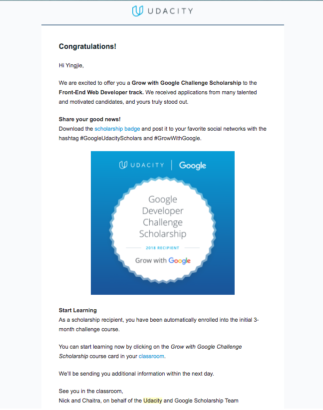



<!-- more -->

## Log

### 2018-01-10 Wednesday
The acceptance letter was in the Gmail inbox. I did not open it until 11 p.m.. It made my day! This month (or from the beginning of 2018), two things made me happy. 😆

1. [Awesome Checklist Checklist](https://github.com/huyingjie/Checklist-Checklist) project got [over 1500 stars](http://yingjiehu.com/awesome-checklist-checklist/). (2018-01-08)

2. I got the acceptance letter from Grow with Google Challenge Scholarship. (2018-01-10)

I did not expect that Udacity would give me scholarship because they rejected me once in the middle of last year (2017). Google sponsored `Women Techmakers Udacity Scholarship` whose deadline was June 9, 2017. I encouraged my roommate to apply for the scholarship. Both of us were rejected. 😢

It never hurts to try applying again. It is my day! 🌈☀️

### 2018-01-11 Thursday

The excitement to receive Grow with Google Challenge Scholarship disappears!

There is a big difference between Udacity and FreeCodeCamp: projects.

Projects on FreeCodeCamp requires students to finish complete websites. In the future, you can show your websites to other people. Here are the first two FreeCodeCamp projects made by me: 

* [Github Repo](https://github.com/huyingjie/tribute-zhugeliang) | [Project 1: Tribue](http://zhugeliang.yingjiehu.com/)
* [Github Repo](https://github.com/huyingjie/projects-page) | [Project 2: Personal Portfolio](http://projects.yingjiehu.com/)

Each project took several hours to finish. It was hard but doable. (This is the essence of learning.)

In the process of doing projects, I learned how to read official documents of Bootstrap and jQuery without effort. FreeCodeCamp did not teach this. I think almost all students will learn it naturally when working on FreeCodeCamp projects.

The first two projects on Udacity

1. Project: Mockup to Article
2. Project: Animal Trading Cards (20 minutes)

From the title and time suggested, you can see that the projects are a duplicate of other people's work. Hence, you definitely cannot show them to your friends, coworkers, or future employers.

Udacity's projects are a mix of tutorials and exercise. It will teach students what students will use in the "projects" first, and then ask students to reproduce the example. Do you know that every tutorial on FreeCodeCamp is a mix of tutorials and exercise? But FreeCodeCamp does not treat them as a project. They are just tutorials.

With the same amount time spent, you will learn more from FreeCodeCamp than from Udacity.

This is the reason I used the strikethrough: <del>**Link**: Github Repo| Project</del>. No more project will be produced during the study on Udacity.

**I feel guilty of counting the Udacity project into the challenge.**

Usually, I study tutorials for an hour and code for an hour every day. 

Solution: 

* Count anything on Udacity into the tutorial part.
* Continue to do FreeCodeCamp projects.

**Updates**

I read the AMA record and here are my thoughts.

1. Udacity puts more emphasis on social networking than the quality of learning.

	There are two criteria to be accepted into Round 2 and an addition one that was mentioned in the AMA record.

	1. Completion of the course before April 11.
	2. Activities in the slack and the forum.
	3. (not mentioned pubicly) Diversity

	Udacity uses whether students are active in the forum/slack as a critera for the quality of learning. The company cares about the leadership more than learning itself. I do not agree with the idea.

2. Emphyasis on social networking increases my stress level of learning.

	I am not the fan of spending so much on social networking or collaborating. If I want to be active on either of channels, I have to use willpower to do so. This does not belong to my learning goal. As an introvert, I am reluctant to waste willpower this way.
	
3. Projects will not be graded. I am disappointed.

	Thanks to FreeCodeCamp. I finally achieve learning and doing projects at the same time. All projects can be contributed to 100 Days of Code challenge. 
	
	Udacity does not emphyasize on the projects at all. I realize that there will be few projects made by students at the end of the course. It is not a good way to track progress during study.
	
	It reminded me of my previous course on Udacity, making iOS apps. After learning that course, I cannot make an app from start to end.

4. The order of importance: Finishing the course -> Forum activity -> Slack activity. 

	
	
